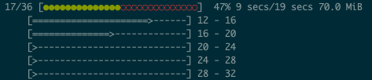

# Wwwision.BatchProcessing

Helpers to execute [Flow](https://flow.neos.io) CLI Commands in parallel using [ReactPHP ChildProcess](https://reactphp.org/child-process/):



## Installation

Install this package via:

```bash
composer require wwwision/batch-processing
```

## Usage

Invoke `BatchProcessRunner::start()` from a Flow `CommandController`.

Example:

```php
<?php
use Neos\Flow\Annotations as Flow;
use Wwwision\BatchProcessing\BatchProcessRunner;

class SomeCommandController extends CommandController
{

    public function someMainCommand(): void
    {
        $runner = new BatchProcessRunner('somebatch');
        $runner->start();
    }

    /**
     * @param int $offset zero based offset
     * @param int $limit size of the batch to process
     * @internal
     */
    public function someBatchCommand(int $offset, int $limit): void
    {
        // process batch of size $limit from $offset
    }
}
```

(see full example below)

### Custom batch command arguments

By default, the arguments `offset` and `limit` will be passed to the batch command.
This can be changed via constructor arguments of the `BatchProcessRunner`, the placeholders `{offset}` and `{limit}` can be used:

```php
$runner = new BatchProcessRunner('some:batch:command', ['start' => '{offset}', 'size' => '{limit}', 'some-custom-arg' => 'some value']);
```

### Render progress bar(s)

The `ProgressBarRenderer` can be used to output progress bar(s) like shown in the screenshot above:

```php
$progressHandler = ProgressBarRenderer::create($this->output->getOutput());
$runner = new BatchProcessRunner('some:batch:command', null, $progressHandler);
```

To allow the individual batches to report their progress and errors, the `ProgressPipe` can be used:

```php
$progressPipe = new ProgressPipe();
for ($i = $offset; $i < ($offset + $limit); $i ++) {
    try {
        // do something
    } catch (SomeException $e) {
        $progressPipe->error($e->getMessage());
    }
    $progressPipe->set($i);
}
```

### Specify batch size

By default, the batch size is *500*.
This means that for a total amount of *1234* tasks the batch command will be called three times with a `offset/limit` of:
* `0/500`
* `500/500`
* `1000/234`

The batch size can be adjusted via `BatchProcessRunner::setBatchSize()`.

*Note:* The right size for the size of a batch depends greatly upon how long each task will take and how much memory it will consume.

### Specify pool size 

By default, up to *5* sub processes will be executed in parallel.
This can be adjusted via `BatchProcessRunner::setPoolSize()`.

*Note:* To prevent parallel execution of batches, set the pool size to *1*

### Handle finished process

Because `BatchProcessRunner::start()` is executed in a *non-blocking* way, the following code *will not work as expected*:
```php
$runner->start($totalAmountOfTasks);
$this->outputLine('This might be outputted before the runner has been finished!')
```

Instead, the `BatchProcessRunner::onFinish()` callback should be used to finalize the process:

```php
$runner->onFinish(function() {
    $this->outputLine('This will be outputted when all tasks have been processed');
});
$runner->start($totalAmountOfTasks);
```

### Handle errors

To prevent interrupting the batch processing or messing with the progress bar rendering, errors are not outputted by default.
Instead, they can be handled via `BatchProcessRunner::onError()` callback:

```php
$runner->onError(function(string $message) {
    $this->outputLine('<error>%s</error>', $message);
})
```

Alternatively, the `onFinish()` can be used to handle all errors that occurred during the batch processing:

```php
$runner->onFinish(function(array $errors) {
    if ($errors !== []) {
        $this->outputLine('<error>%d errors occurred!</error>', [count($errors)]);
    }
});
```

## Full example

```php
<?php

use Neos\Flow\Cli\CommandController;
use Wwwision\BatchProcessing\BatchProcessRunner;
use Wwwision\BatchProcessing\ProgressHandler\NullProgressHandler;
use Wwwision\BatchProcessing\ProgressHandler\ProgressBarRenderer;
use Wwwision\BatchProcessing\ProgressPipe;

class SomeCommandController extends CommandController
{
    public function someMainCommand(string $someArg, int $batchSize = null, int $poolSize = null, bool $quiet = false): void
    {
        $numberOfTasks = $this->determineNumberOfTasks();
        $quiet || $this->outputLine('Processing <b>%d</b> tasks...', [$numberOfTasks]);
        $progressHandler = $quiet ? new NullProgressHandler() : ProgressBarRenderer::create($this->output->getOutput());
        $runner = new BatchProcessRunner('some.package:some:somebatch', ['someArg' => $someArg, 'offset' => '{offset}', 'limit' => '{limit}'], $progressHandler);
        if ($batchSize !== null) {
            $runner->setBatchSize($batchSize);
        }
        if ($poolSize !== null) {
            $runner->setPoolSize($poolSize);
        }
        $runner->onFinish(function(array $errors) use ($quiet) {
            if ($errors === []) {
                $quiet || $this->outputLine('<success>Done</success>');
                return;
            }
            $this->outputLine('<error>Finished with <b>%d</b> error%s%s</error>', [\count($errors), \count($errors) === 1 ? '' : 's', $quiet ? '' : ':']);
            if (!$quiet) {
                foreach ($errors as $error) {
                    $this->outputLine('  %s', [$error]);
                }
            }
            exit(1);
        });
        $runner->start($numberOfTasks);
    }

    /**
     * @param string $someArg some custom argument
     * @param int $offset zero based offset
     * @param int $limit size of the batch to import
     * @internal
     */
    public function someBatchCommand(string $someArg, int $offset, int $limit): void
    {
        $processPipe = new ProgressPipe();
        foreach ($this->getTasks($offset, $limit) as $task) {
            try {
                $task->process();
            } catch (\Throwable $e) {
                $processPipe->error($e->getMessage());
            }
            $processPipe->advance();
        }
    }
}
```

## Contribution

Contributions in the form of issues or pull requests are highly appreciated

## License

See [LICENSE](./LICENSE)
